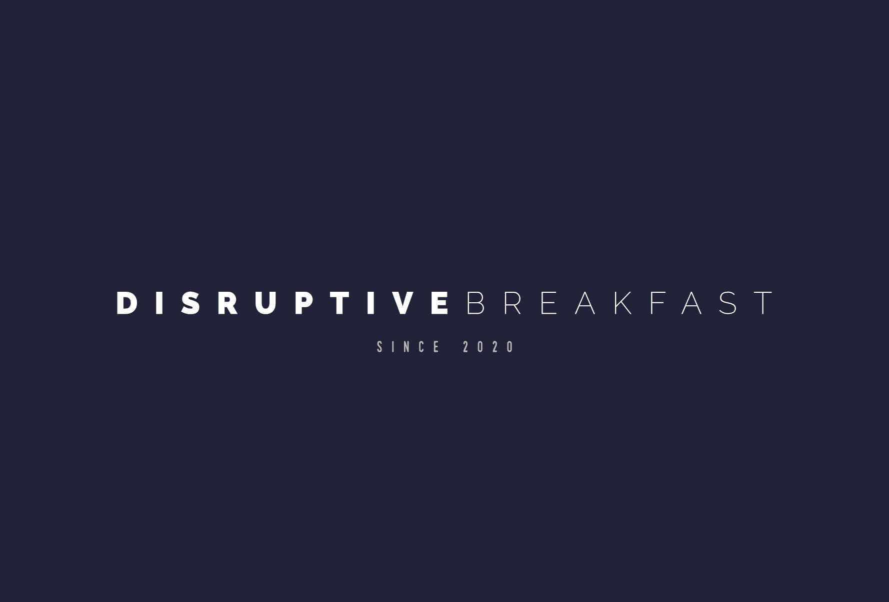

# Disruptive Breakfast

An absurdist Python tool that scrapes website content and uses basic NLP concepts to generate high-impact names for your new web agency.

The ridiculous name for this tool was, of course, generated by the tool itself.

If you're reading all of this and wondering why the heck this repo even exists, you can [read the accompanying blog post on my website](http://robbowen.digital/wrote-about/how-to-name-your-web-agency-with-nlp/)

## Installation and pre-requisites
This project is built on Python 3 and uses a pipfile to manage its dependencies. The recommended usage is with pipenv.

* [How to install Python 3 for your OS](https://docs.python-guide.org/starting/installation/)
* [How to install pipenv](https://pipenv-fork.readthedocs.io/en/latest/)

With the above installed, you can create your virtual environment and install the dependencies by opening the project root directory in your terminal and running:
```
pipenv install
```

## Generating a name for your web agency
Before running the tool, the replace the list of URLS on line 60 of `main.py` with a list of urls to your favourite websites.

Once everything is properly installed, you can run the tool with the following command:
```
pipenv run python main.py
```
When it has finished processing, it will create a file named `output.txt` containing 500 randomly generated names.

Enjoy!